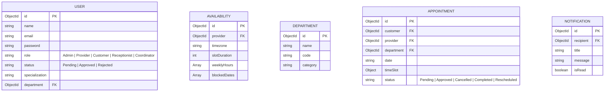

# Schedulify - Premium MERN SaaS Appointment Scheduler

A complete, production-ready SaaS Appointment Scheduling Platform featuring a visionOS-inspired glassmorphism theme, SVG pixel art icons, and responsive layouts. Designed for universities, hospitals, corporate offices, lawyers, and freelancers.

## 🚀 Tech Stack

- **Frontend**: React.js, JavaScript, React Router DOM, Axios, Context API, Vanilla CSS (macOS Sonoma / VisionOS glassmorphic style), Framer Motion, React Icons, Chart.js, React Toastify.
- **Backend**: Node.js, Express.js, JWT Authentication, bcrypt, Multer, Nodemailer, Cookie Parser, Morgan, Helmet.
- **Database**: MongoDB & Mongoose.

---

## 📂 Project Structure

```text
appointment-saas/
├── backend/
│   ├── config/          # Database configuration
│   ├── controllers/     # API request handlers
│   ├── middleware/      # Auth & file uploads middleware
│   ├── models/          # Mongoose Database Schemas
│   ├── routes/          # Express route endpoints
│   ├── uploads/         # Profile avatar uploads storage
│   ├── utils/           # Nodemailer email sender wrapper
│   ├── app.js           # Express app setup & middleware
│   └── server.js        # Main entry point
├── frontend/
│   ├── public/          # HTML templates & manifest
│   └── src/
│       ├── components/  # Reusable custom SVG pixel icons
│       ├── context/     # AuthContext & ThemeContext
│       ├── pages/       # Glassmorphic views (LandingPage, Dashboard, booking steps)
│       ├── App.js       # Main application layout and routes
│       └── index.js     # React root element mounting
├── seed.js              # Database populator script
├── package.json         # Concurrent MERN script launcher
└── .env                 # Server configuration env vars
```

---

## 🛠️ Installation & Setup

### Prerequisites
- Node.js installed locally.
- MongoDB server running locally (or MongoDB Atlas connection string).

### Setup Instructions

1. Clone or navigate to the directory:
   ```bash
   cd C:/Users/aarya/.gemini/antigravity/scratch/appointment-saas
   ```

2. Install all dependencies for root, backend, and frontend concurrently:
   ```bash
   npm run install-all
   ```

3. Configure environmental variables:
   Review and adjust `.env` or `backend/.env` files. Default configurations are already set to point to `mongodb://127.0.0.1:27017/appointment-scheduler`.

4. Seed the database with mock records (Admin, Providers, Departments, Historical bookings):
   ```bash
   npm run seed
   ```

5. Launch both the backend server and frontend development server concurrently:
   ```bash
   npm run dev
   ```

---

## 🔑 Default Credentials (Seeded Accounts)

You can log in immediately using the following accounts (all passwords are `password123`):

- **System Administrator**: `admin@scheduler.com`
- **University Coordinator**: `coordinator@scheduler.com`
- **Receptionist**: `receptionist@scheduler.com`
- **Provider 1 (Prof. Alan Turing)**: `alan@scheduler.com`
- **Provider 2 (Dr. Elizabeth Blackwell)**: `elizabeth@scheduler.com`
- **Customer**: `customer@scheduler.com`

---

## 📊 Database Schema



---

## 🛰️ Backend API Endpoints

### Authentication
- `POST /api/auth/register` - Create new customer/provider account
- `POST /api/auth/login` - Authenticate user & issue cookie token
- `GET /api/auth/me` - Fetch profile of logged-in user
- `GET /api/auth/logout` - Clear cookie tokens
- `POST /api/auth/forgotpassword` - Request password recovery link
- `PUT /api/auth/resetpassword/:token` - Reset password

### Appointments
- `POST /api/appointments` - Schedule a new appointment (Customer)
- `GET /api/appointments` - Fetch appointments list (filtered by role permissions)
- `PUT /api/appointments/:id/accept` - Accept booking (Provider/Receptionist)
- `PUT /api/appointments/:id/reject` - Decline booking (Provider/Receptionist)
- `PUT /api/appointments/:id/reschedule` - Propose alternative slot
- `PUT /api/appointments/:id/notes` - Add consultation notes (Provider)

### Admin & Analytics
- `GET /api/admin/settings` - Retrieve global settings (Admin)
- `PUT /api/admin/settings` - Save platform configurations (Admin)
- `GET /api/admin/providers/pending` - List providers requesting approval
- `PUT /api/admin/providers/:id/approve` - Approve provider request
- `GET /api/analytics/dashboard` - Retrieve aggregated metrics for Chart.js
